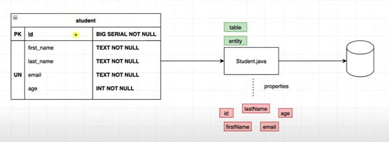

# Section 1

* 1 schema
  * student
    

* [Student Entity](./src/main/java/com/example/springbootjpastudy/Student.java)
  * column 정의
  * constructor
    * 빈 것, 모두, primary 빼고
  * getter and setter
  * toString
  * intellij 단축키 : (Generator) `Alt` + `Fn` + `Insert`

* annotation
  * `@Entity` :  JPA 관리, 테이블과 매핑
    * `name` : 외부에서 사용할 이름 (default는 class name)
  * `@Table` : 
  * Column
    * primary key
      * `@Id` : primary key 임을 명시
      * for big serial 만들기
        * `@SequenceGenerator` : 얼마의 크기로 증가할 지 정함
        * `@GeneratedValue` : 위(SequenceGenerator)에서 만든 제너레이터로 실제 column의 값 증가
        ```java
        @Id
        @SequenceGenerator(
          name = "student_sequence",
          sequenceName = "student_sequence",
          allocationSize = 1
        )
        @GeneratedValue(
          strategy = GenerationType.SEQUENCE,
          generator = "student_sequence"
        )
        ```


